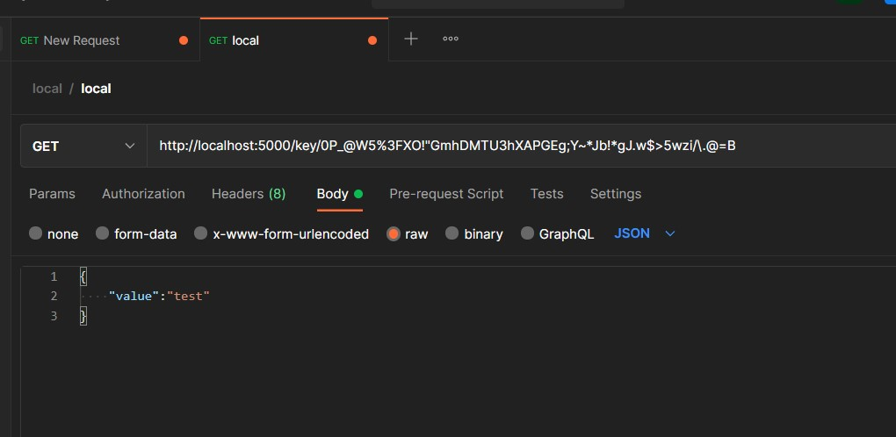

# nasa lab10

## Description
>See [Lab10.pdf](./Lab10.pdf) file for more info.

Lab requirements

* Nginx
* Simple CRUD Server
* Database

## Set up nginx

Install nginx service.

```shell
sudo apt install nginx
```

Configure nginx setting(Modify `/etc/nginx/sites-enabled/default`)

```nginx
server {
        listen 80 default_server;
        listen [::]:80 default_server;

        server_name _;

        location / {
                access_log /var/log/nginx/postdata.log postdata;
                proxy_pass http://127.0.0.1:5000/;
        }
}
```

Check syntax

```shell
sudo nginx -t
```

Then restart nginx service

```shell
sudo systemctl restart nginx
sudo systemctl status nginx --lines 50
```

## Install Redis

Install redis

```shell
sudo apt install redis
```

Test redis status

```shell
$redis-cli
127.0.0.1:6379>ping
PONG
127.0.0.1:6379>exit
$
```

## Run server

Install dependency

```shell
pip3 install flask redis
```

Run flask

```shell
python3 server.py
```

Access website from Host

```md
http://localhost:80 
# or 
http://10.100.100.<num>:80 (via vpn)
```

Another test api approach:Use Postman

